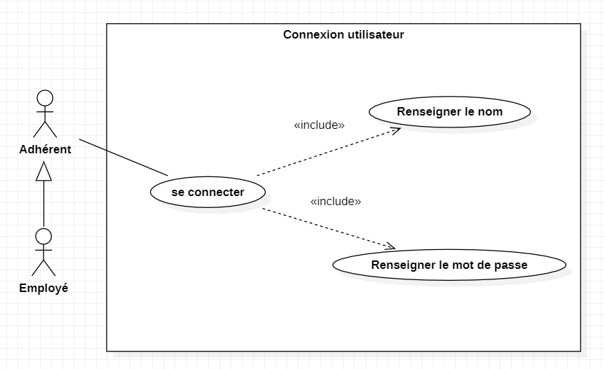
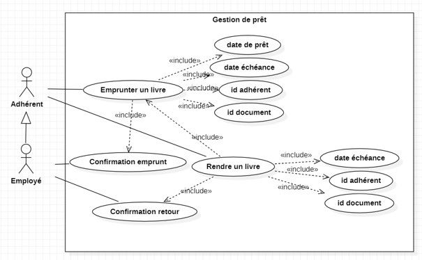
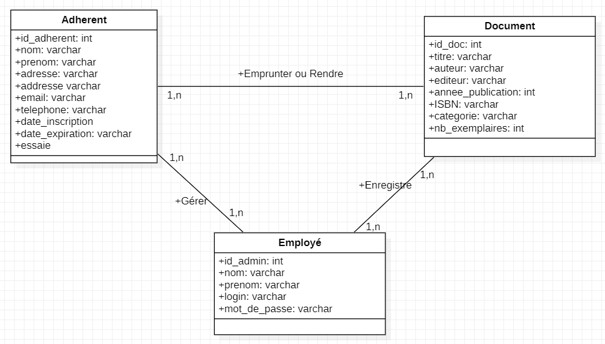
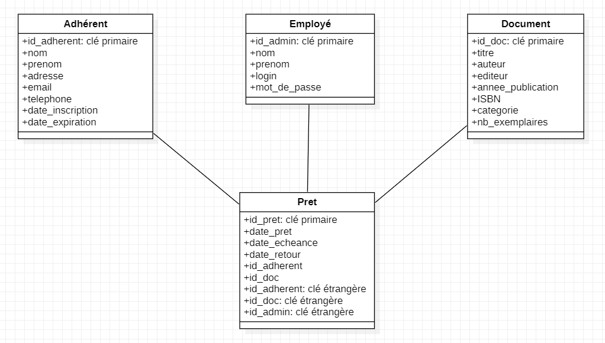

# 📚 Django Library Management System


A full-stack, modular library management system built with Python, Django, and PostgreSQL. This project focuses on clean backend architecture, relational database modeling, and strict Role-Based Access Control (RBAC).

## 📊 System Modeling (UML)

The system was fully modeled prior to development to ensure structural integrity and clear separation of concerns between our two main actors: the Member (Adhérent) and the Employee (Employé).

### Use Case Diagrams
The application distinguishes basic authentication from strict loan management, where only an employee can register a loan.

**User Connection:**


**Loan Management:**


### Database Modeling
The database architecture links Members, Employees, and Documents through a Loan (Prêt) entity.

**Conceptual Data Model (MCD):**


**Relational Model:**


## 🏗️ Project Architecture

The system is designed with a strict modular architecture where each Django application has a single, well-defined responsibility:
*   **`bd` (Database Core):** The foundation of the project containing the structural data models (`models.py`). 
*   **`authentification`:** Dedicated exclusively to system access via email and secure login sessions.
*   **`gestionLivres` (Business Logic):** The operational brain handling CRUD operations for books and enforcing business rules.
*   **`accueil`:** A lightweight entry-point application serving the main dashboard.

## 🔐 Security & Business Logic

Access to sensitive endpoints is protected by custom decorators and business rules derived from our initial specifications:
*   **Role Management:** An `is_admin` boolean separates Members (who can only borrow, return, and login) from Employees (who manage accounts, documents, and validate loans/returns).
*   **Loan Duration:** A loan is strictly fixed to 15 days.
*   **Stock Verification:** A document can only be borrowed if at least one copy is available. The system automatically updates the inventory when a loan or return is processed.
*   **Privilege Restriction:** Only authorized employees can register a loan. Standard members are restricted by `@login_required` decorators.

## 🚀 Local Installation Guide

### 1. Database Prerequisites
1. Ensure **PostgreSQL** is installed.
2. Create an empty database and a PostgreSQL user with privileges.

### 2. Environment Configuration
Create a `.env` file at the root of the project to secure credentials:

```env
SECRET_KEY=your_very_long_secure_django_secret_key
DB_NAME=your_db_name
DB_USER=your_postgres_user
DB_PASSWORD=your_postgres_password
DB_HOST=localhost
DB_PORT=5432
```

### 3. Build and Run
```bash
python -m venv venv
# Windows: .\venv\Scripts\activate | Mac/Linux: source venv/bin/activate
pip install django psycopg2-binary python-dotenv
python manage.py makemigrations bd
python manage.py makemigrations
python manage.py migrate
python manage.py createsuperuser
python manage.py runserver
```

---
*Developed by Vianney Chaillou | ESAIP Engineering Student*